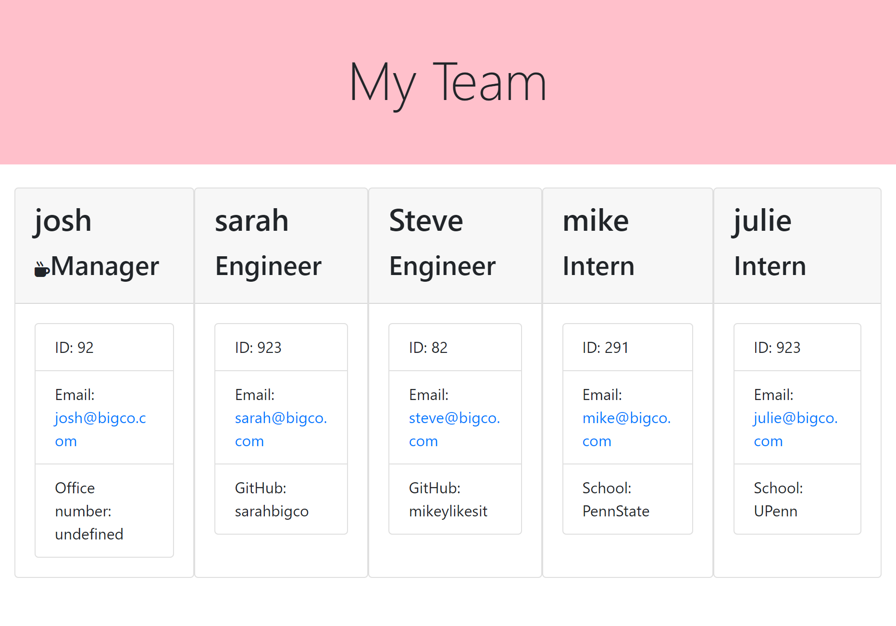

# 10-Team-Profile-Generator
## Description
Provide a short description explaining the what, why, and how of your project. Use the following questions as a guide:
- What was your motivation?
- Why did you build this project? (Note: the answer is not "Because it was a homework assignment.")
- What problem does it solve?
- What did you learn?
## Table of Contents (Optional)
If your README is long, add a table of contents to make it easy for users to find what they need.
- [Installation](#installation)
- [Usage](#usage)
- [Credits](#credits)
- [License](#license)
## Installation
The .gitignore file should have at least node_modules in it because Inquirer and Jest modules will be kept in the folder 'node_modules'.
Inquirer and Jest packages need to be installed. At the prompt of a Bash shell type these commands
npm init -y
npm i inquirer
npm i -D jest

## Usage
The lib folder contains 4 class definition files. The Manager, Engineer and Intern classes inherit from the Employee test. These classes are used in index.js and have corresponding test files in the folder __tests__. Jest is used to test those classes.
The team profile is created from the answers to questions asked by the Inquirer package in index.js. To create the team profile web page
node index
The link to a mp4 showing the user answering questions about the the is here
![Video showing the answer to questions, the testing with Jest and the My team web page] ()
The file team.html is output to the folder 'dist'.




## Credits

Trilogy Education Services provided the HTML and CSS code to me. I then programmed the JavaScript code.

## License

Copyright (c) [2021] [William T Pate]

Permission is hereby granted, free of charge, to any person obtaining a copy
of this software and associated documentation files (the "Software"), to deal
in the Software without restriction, including without limitation the rights
to use, copy, modify, merge, publish, distribute, sublicense, and/or sell
copies of the Software, and to permit persons to whom the Software is
furnished to do so, subject to the following conditions:

The above copyright notice and this permission notice shall be included in all
copies or substantial portions of the Software.

THE SOFTWARE IS PROVIDED "AS IS", WITHOUT WARRANTY OF ANY KIND, EXPRESS OR
IMPLIED, INCLUDING BUT NOT LIMITED TO THE WARRANTIES OF MERCHANTABILITY,
FITNESS FOR A PARTICULAR PURPOSE AND NONINFRINGEMENT. IN NO EVENT SHALL THE
AUTHORS OR COPYRIGHT HOLDERS BE LIABLE FOR ANY CLAIM, DAMAGES OR OTHER
LIABILITY, WHETHER IN AN ACTION OF CONTRACT, TORT OR OTHERWISE, ARISING FROM,
OUT OF OR IN CONNECTION WITH THE SOFTWARE OR THE USE OR OTHER DEALINGS IN THE
SOFTWARE.


## Tests
After installing Jest with <br>
```
    npm i -D jest
```
then change package.json so that scripts is 
```

  "scripts": {
    "test": "jest"
```
